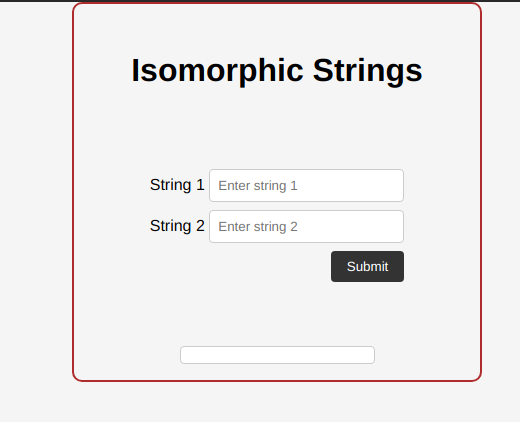

<!--deno-lint-ignore-file  -->
# Isomorphic0String
This little project is about isomorphic string.Two strings are considered isomorphic when they can be mapped or transformed into one another by replacing each character in the first string with another character while preserving the order. This mapping between characters in both strings should maintain consistency and uniqueness, meaning that no two characters in the first string can be replaced by the same character in the second string, and vice versa
## FonctionalityA
- The first input is to type the first string.
- the second one is to type the value of the second string.
- you will see a submit button who will help you to check if the strings you enter are Isomorpgic or not .

## Prerequisites
- Node.js and npm must be installed on your machine.

## Installation
- Clone this repository on your machine.
- Access the project directory in your terminal. <!--eslint-disable-line -->
- Install the dependencies by running the npm install command.

## usage
- can be used for store.

## an Image
.
